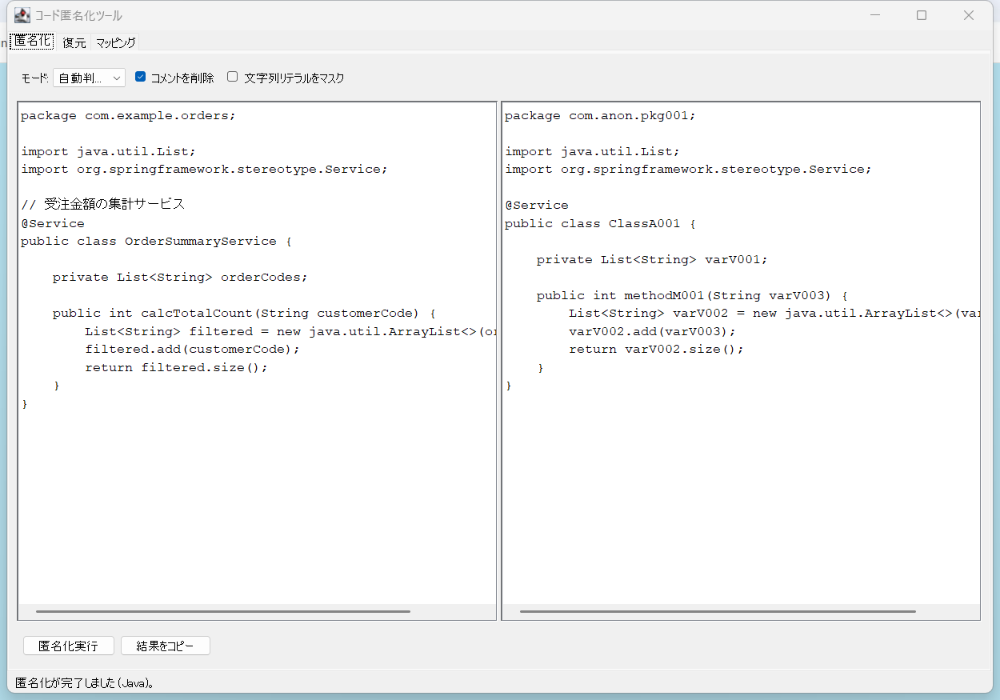

# code-anonymizer

業務のJava/SQLソースコードをAIチャット(ChatGPT/Claude等)に貼る前に、クラス名・メソッド名・変数名・テーブル名・カラム名・コメントを機械的な名前に匿名化し、AIの回答を逆変換で元に戻すWindowsデスクトップアプリです。

マッピング（元名⇔置換名の対応表）は `%APPDATA%\code-anonymizer\mapping.json` にのみローカル保存され、外部に送信されることはありません。



※画面のコードはデモ用のサンプルです。実際の業務コードではありません。

## 構成

- `core/` — 匿名化・復元のコアロジック（GUI非依存、JUnit5でテスト）
- `ui/` — Swingベースのデスクトップアプリ（3タブ: 匿名化 / 復元 / マッピング）

## ビルド手順（配布用exeインストーラの作成）

**Windows実機でのビルドが必須です。** クロスビルドはできません（jpackage/jlinkがOS依存のネイティブランタイムを生成するため）。

### 前提環境

- Windows 10/11
- JDK 17以上（[Eclipse Temurin](https://adoptium.net/) 推奨。`jpackage`/`jlink`が同梱されていること）
- WiX Toolset 3.x （`.exe`インストーラ生成に必要。jpackageが内部で使用します）
  - firegiant.com経由での配布に変更されており入手しづらい場合は、GitHub Releasesから直接入手できます:
    https://github.com/wixtoolset/wix3/releases （`wix314.exe` を実行してインストール。PATHに自動追加されます）
  - `light.exe` / `candle.exe` がPATH上にあることを `where light.exe` などで確認してください
- インターネット接続（Gradle依存関係の初回ダウンロード用）

`JAVA_HOME` がJDK17以上を指しているか、`java -version` で確認してください。

### ビルドコマンド

```powershell
# コアロジックのテスト実行
.\gradlew.bat test

# 実行可能fat jarの作成 (ui/build/libs/code-anonymizer-all.jar)
.\gradlew.bat shadowJar

# Windows用exeインストーラの作成 (ui/build/jpackage/CodeAnonymizer-<version>.exe)
.\gradlew.bat jpackage
```

`jpackage` タスクは内部で以下を行います。

1. `shadowJar` でfat jarを作成
2. `jlink` でJava未インストール環境でも動く最小ランタイムイメージを作成（`java.base`, `java.desktop`, `java.logging`, `java.xml` 等を同梱）
3. `jpackage --type exe` でスタートメニュー登録・デスクトップショートカット・インストール先選択に対応したexeインストーラを生成

Windows以外の環境で `jlinkRuntime` / `jpackage` タスクを実行するとエラーで中断します。

## 同僚への配布時の注意（SmartScreen警告について）

このインストーラは社内独自ビルドのため、コード署名証明書がありません。配布先のPCで実行すると「WindowsによってPCが保護されました」という**SmartScreen警告**が表示される場合があります。その場合は以下の手順で実行してください。

1. 警告画面で「詳細情報」をクリック
2. 表示された「実行」ボタンをクリック

不明なアプリの実行に不安がある場合は、社内配布元（送付者）に確認してから実行してください。

## 使い方

1. 「匿名化」タブに業務コードを貼り付け、モード（自動判定/Java/SQL）とオプションを選び「匿名化実行」
2. 匿名化された結果をコピーしてAIチャットに貼り付け、回答を得る
3. 「復元」タブにAIの回答を貼り付け「復元実行」すると元の名前に戻る
4. 「マッピング」タブで現在の対応表を確認・切替・新規作成できる（このファイルは機密情報なので社外に出さないこと）

## テスト

コアロジックのみJUnit5でテストしています（GUIはテスト対象外）。

```powershell
.\gradlew.bat test
```

## ライセンスと使用ライブラリ

本アプリは以下のオープンソースソフトウェアを利用しています。詳細な帰属表示は
[THIRD-PARTY-NOTICES.md](THIRD-PARTY-NOTICES.md) を参照してください（配布用jar/exeの
`META-INF/THIRD-PARTY-NOTICES.md` にも同梱されています）。

| ライブラリ | ライセンス |
|---|---|
| [JavaParser](https://github.com/javaparser/javaparser) | Apache-2.0（LGPL-3.0とのデュアルライセンスのうちApache-2.0を選択） |
| [JSqlParser](https://github.com/JSQLParser/JSqlParser) | Apache-2.0（LGPL-2.1とのデュアルライセンスのうちApache-2.0を選択） |
| [Jackson](https://github.com/FasterXML/jackson) | Apache-2.0 |
| [Eclipse Temurin](https://adoptium.net/)（同梱JRE） | GPLv2 with Classpath Exception |

本プロジェクト自体は [Apache License 2.0](LICENSE) で公開しています。
